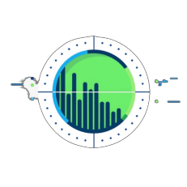
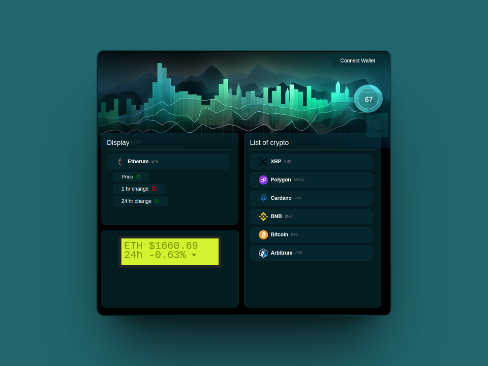

 

 
 
Krypto Watcher - Be alwagys on time
 

 

<!-- ABOUT THE PROJECT -->
## About The Project

  
This project is a dashboard designed for controlling a crypto clock, which displays the current price and the change within either 1 hour or 24 hours.

### Built With

*  REACT
*  VITE 
*  SASS 

## Getting Started

https://kryptowatcher.netlify.app/
* Just connect your MetaMask wallet and start using

## Roadmap

- [x] Add drag and drop style
- [x] Add live price update
- [ ] Add display options
- [ ] Add real lcd 16x2 display

## License

Distributed under the MIT License. See `LICENSE.txt` for more information.

